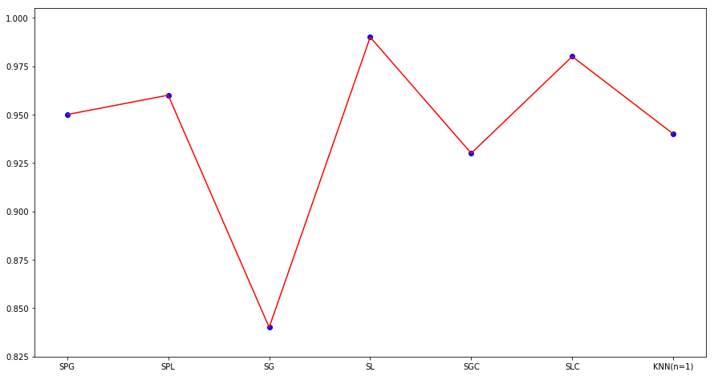

## 얼굴분류 ##
    sklearn 패키지에서 지원하는 datsets 중 하나인 fetch_olivetti_faces()를 이용한 얼굴분류

### datasets
- target : 0 ~ 39(400, )
- [data](http://www.cl.cam.ac.uk/research/dtg/attarchive/facesataglance.html) : 64*64 흑백 이미지 명암의 정도에 대한 픽셀값(400, 4096)

### classification_method
- [SVM_PCA_Gaussain](https://github.com/ber01/Study-ML/blob/master/face/SVM_PCA_Gaussain) : decomposition.PCA(n=150) + svm.SVC(C=5., gamma=0.001) - test:train = 1:3
- [SVM_PCA_Linear](https://github.com/ber01/Study-ML/blob/master/face/SVM_PCA_Linear.py) : decomposition.PCA(n=150) + svm.SVC(kernel='linear') - test:train = 1:3
- [SVM_Gaussain](https://github.com/ber01/Study-ML/blob/master/face/SVM_Gaussian.py) : svm.SVC(C=5., gamma=0.001) - test:train = 1:3
- [SVM_Linear](https://github.com/ber01/Study-ML/blob/master/face/SVM_Linear.py) : svm.SVC(kernel='linear') - test:train = 1:3
- [SVM_Gaussain_CV](https://github.com/ber01/Study-ML/blob/master/face/SVM_Gaussain_CV.py) : KFold(n=10) + svm.SVC(C=5., gamma=0.001) - cross validation(10-fold)
- [SVM_Linear_CV](https://github.com/ber01/Study-ML/blob/master/face/SVM_Linear_CV.py) : KFold(n=10) + svm.SVC(kernel='linear') - cross validation(10-fold)
- [KNN](https://github.com/ber01/Study-ML/blob/master/face/KNN.py) : KNeighborsClassifier(n=1) - test:train = 1:3

### result
- #### f1-score(SVM)
| SVM_PCA_Gaussian | SVM_PCA_Linear | SVM_Gaussian | SVM_Linear | SVM_Gaussian_CV | SVM_Linear_CV |
|:-----:|:-----:|:-----:|:-----:|:-----:|:-----:|
| 0.95 | 0.96 | 0.84 | 0.99 | 0.93 | 0.98 |

- #### f1-score(KNN)
| n_neighbors=1 | n_neighbors=2 | n_neighbors=3 | n_neighbors=4 | n_neighbors=5 | n_neighbors=6 |
|:-----:|:-----:|:-----:|:-----:|:-----:|:-----:|
| 0.94 | 0.89 | 0.81 | 0.75 | 0.78 | 0.76 |

### Graph

